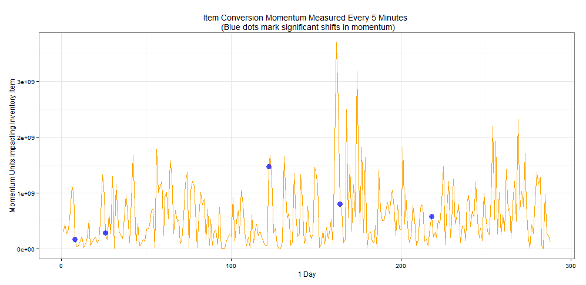

# MCOMPPI
Product Popularity Index Project

* Data csv is in Data/ folder
* Predicted Momentum has some errors (gotta tweak my distributions)
* Assumptions around the distributions:

  INVENTORY AVAILABILITY: "inv.avail"
  
  A Gaussian distribution is assumed, to begin with the passed in inventory
  average. It uses 40% of the average as the variation from mean inventory.
  This approximates the "Stock Control Model". 
  We're not going to model the stock buffer here. Instead, we'll take all 
  0 and - data points to approximate the lower gaussian ranges.

  ATB VELOCITY
  TOTAL ITEMS IN MCOM BAGS (POTENTIAL CONVERSIONS, ATB VELOCITY)/time interval

  We're going to use a Bimodal Gaussian distribution to simulate the velocity
  of items being added to bag in a day. The first period is a gaussian dist. 
  that suggests early day passive buying with a peak, whereas the second period
  suggests increased buying activity and thus item velocity.
  Since this distribution simulates velocity over a day, we first break down 
  the data set by intended time interval.
  
  SELL VELOCITY
  Same.

# Issues still being worked out